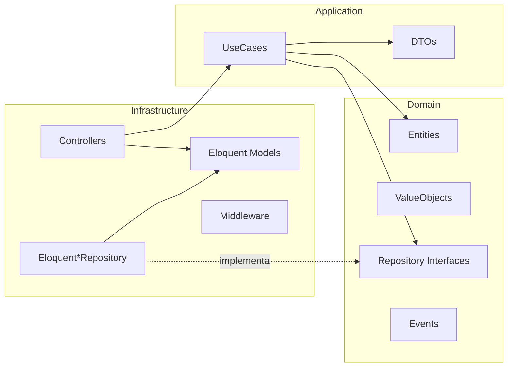
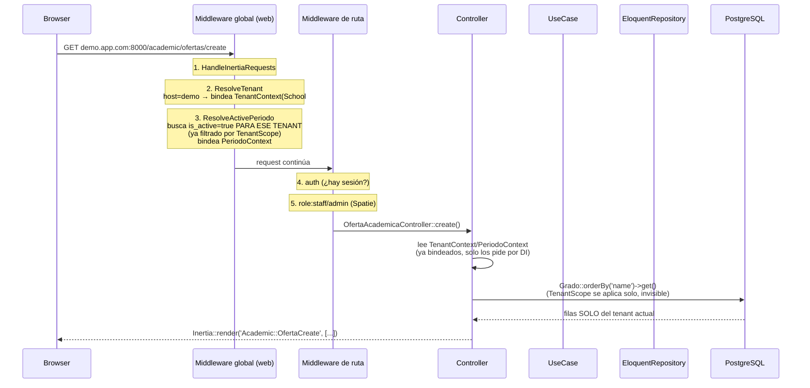
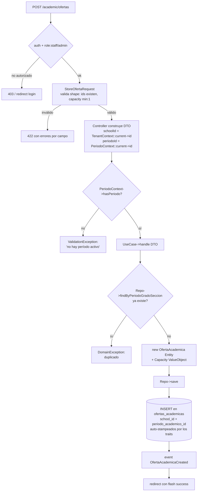
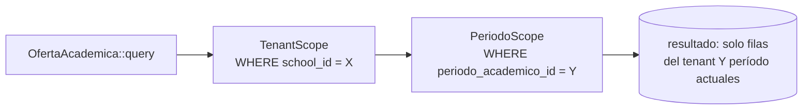
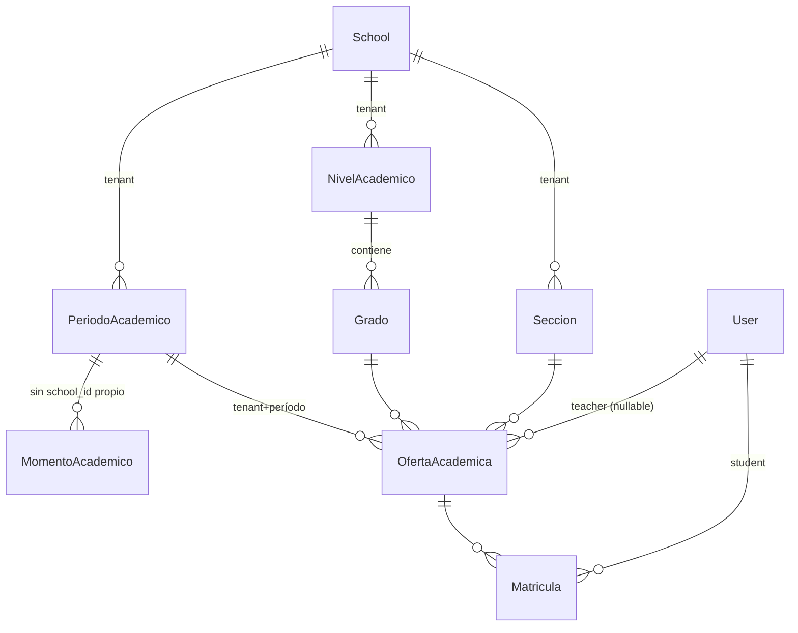

# Cómo se crea e implementa un módulo nuevo en EDUCATIVO

Este documento explica, con base en el patrón **real** ya implementado en `Modules/Academic` (verificado leyendo el código, no inventado), qué pasa exactamente cuando agregás un módulo nuevo: qué archivos se tocan, cómo se registran rutas y middleware, cómo viaja una request de punta a punta, y cómo se comunican seguridad, tenancy y relaciones entre capas.

Referencia de ejemplo real: `Modules/Academic` (rutas, `AcademicServiceProvider`, `OfertaAcademicaController`, `CreateOfertaAcademica`).

---

## 1. Estructura de carpetas de un módulo nuevo

`nwidart/laravel-modules` genera este esqueleto (así nació `Academic`, `Grades`, `Schedule`, etc.):

```
Modules/<NombreModulo>/
├── module.json                          # metadata del módulo (nombre, providers, etc.)
├── composer.json / package.json
├── config/
│   └── config.php
├── routes/
│   ├── web.php                          # rutas con sesión (Inertia)
│   └── api.php                          # rutas stateless
├── Domain/                              # NÚCLEO — sin dependencias de Laravel
│   ├── Entities/                        # objetos de dominio puros (no Eloquent)
│   ├── ValueObjects/                    # ej. Capacity, DateRange
│   ├── Events/                          # eventos de dominio
│   └── Repositories/                    # INTERFACES (contratos)
├── Application/                         # orquestación, sin detalles de infraestructura
│   ├── UseCases/                        # una clase = una acción de negocio
│   ├── DTOs/                            # datos de entrada a un caso de uso
│   └── Services/
├── Infrastructure/                      # el único lugar que sabe de Laravel/Eloquent/HTTP
│   ├── Models/                          # Eloquent, implementan las relaciones reales
│   ├── Persistence/                     # implementaciones Eloquent* de los repository interfaces
│   ├── Http/
│   │   ├── Controllers/
│   │   ├── Requests/                    # FormRequest (validación)
│   │   └── Middleware/                  # middleware propio del módulo (ej. ResolveActivePeriodo)
│   ├── Database/
│   │   ├── Migrations/
│   │   └── Seeders/
│   └── Providers/
│       ├── <Modulo>ServiceProvider.php  # el corazón del módulo
│       ├── RouteServiceProvider.php     # carga web.php / api.php
│       └── EventServiceProvider.php     # listeners de eventos de dominio
├── Resources/js/Pages/                  # componentes Vue del módulo (Inertia)
└── Tests/{Unit,Feature}/
```

**Regla de dependencia (hexagonal)**: `Infrastructure` puede depender de `Application` y `Domain`. `Application` puede depender de `Domain`. **`Domain` no depende de nada** — ni de Eloquent, ni de Laravel, ni de HTTP. Esto es lo que permite testear casos de uso con repositorios fake sin levantar base de datos.



El controlador puede leer modelos Eloquent directamente para *lecturas simples de UI* (como hace `OfertaAcademicaController::create()` trayendo `Grado::orderBy(...)->get()` para poblar un `<select>`), pero toda **escritura de negocio** pasa por un caso de uso.

---

## 2. Registro del módulo: el `ServiceProvider`

`Modules/Academic/Infrastructure/Providers/AcademicServiceProvider.php` es el punto central. Tres responsabilidades clave, en el orden real del código:

### `register()` — bindings de contenedor (corre primero, antes que cualquier otro provider use el contenedor)

```php
public function register(): void
{
    $this->app->bind(OfertaAcademicaRepositoryInterface::class, EloquentOfertaAcademicaRepository::class);
    // ...un bind por cada Repository Interface del módulo

    $this->app->scoped(PeriodoContext::class);   // singleton PERO uno nuevo por request

    $this->app->register(EventServiceProvider::class);
    $this->app->register(RouteServiceProvider::class);
}
```

- Cada **interface de repositorio** (`Domain/Repositories/*Interface.php`) se bindea a su implementación Eloquent (`Infrastructure/Persistence/Eloquent*Repository.php`). Esto es lo que permite que un caso de uso pida `OfertaAcademicaRepositoryInterface` en su constructor y Laravel le inyecte automáticamente `EloquentOfertaAcademicaRepository` — el caso de uso nunca sabe que existe Eloquent.
- `$this->app->scoped(...)` registra un contexto **request-scoped** (como `PeriodoContext` o, a nivel app, `TenantContext`) — vive durante una request y se descarta al terminar. Un módulo nuevo con su propio "contexto de negocio" (ej. un futuro `Modules/Grades` con un `PeriodoEvaluativoContext`) seguiría este mismo patrón.

### `boot()` — todo lo que necesita que el framework ya esté armado

```php
public function boot(): void
{
    $this->registerCommands();
    $this->registerCommandSchedules();
    $this->registerTranslations();
    $this->registerConfig();
    $this->loadMigrationsFrom(module_path($this->name, 'Infrastructure/Database/Migrations'));
    $this->registerInertiaPages();   // registra Resources/js/Pages bajo el namespace "Academic::"
}
```

Acá se cargan las **migraciones del módulo** (así `Modules/Academic` trae sus propias tablas sin tocar `database/migrations/` del core) y se registra el namespace de páginas Inertia (`Inertia::render('Academic::OfertaCreate', ...)`).

---

## 3. Rutas: cómo se registran y qué middleware corre

### `RouteServiceProvider` del módulo

```php
protected function mapWebRoutes(): void
{
    Route::middleware('web')->group(module_path($this->name, '/routes/web.php'));
}

protected function mapApiRoutes(): void
{
    Route::middleware('api')->prefix('api')->name('api.')->group(module_path($this->name, '/routes/api.php'));
}
```

Esto mete las rutas del módulo dentro del grupo de middleware `web` o `api` **global** de Laravel (definido una sola vez en `bootstrap/app.php`), y las rutas `api.php` quedan automáticamente bajo el prefijo `/api` con nombres `api.*`.

### `routes/web.php` del módulo (nivel de ruta específica)

```php
Route::middleware(['auth', 'role:staff/admin'])
    ->prefix('academic')
    ->name('academic.')
    ->group(function () {
        Route::get('ofertas/create', [OfertaAcademicaController::class, 'create'])->name('ofertas.create');
        Route::post('ofertas', [OfertaAcademicaController::class, 'store'])->name('ofertas.store');
    });
```

Acá se agrega la **segunda capa** de middleware, específica de esas rutas: `auth` (usuario logueado) + `role:staff/admin` (alias de Spatie Permission, registrado explícitamente en `bootstrap/app.php`). Un módulo nuevo define su propio prefijo (`/academic`, `/grades`, etc.) y decide qué rol/permiso puede tocar cada ruta.

---

## 4. El pipeline de middleware completo (global → módulo → ruta)

`bootstrap/app.php` define el middleware **global** que corre para TODAS las rutas `web` o `api` del sistema, sin importar el módulo:

```php
$middleware->web(append: [
    HandleInertiaRequests::class,   // comparte props globales (flash, auth.user) con Vue
    ResolveTenant::class,           // clasifica el host → bindea TenantContext (o 404 si host inválido)
    ResolveActivePeriodo::class,    // lee el período activo del tenant → bindea PeriodoContext
]);
```

`ResolveActivePeriodo` vive dentro de `Modules/Academic`, pero como se agrega al grupo `web` **global**, corre para TODAS las requests del sistema (incluso rutas de otros módulos) — es la app entera la que decide "quiero que el contexto de período académico esté siempre disponible", no solo Academic.

Orden exacto de ejecución para `GET /academic/ofertas/create` en el host `demo.app.com`:



**Por qué el orden importa**: `ResolveActivePeriodo` asume que `TenantContext` ya está bindeado (lo dice el comentario del propio código: *"MUST run after ResolveTenant"*). Si un módulo nuevo agrega su propio middleware de contexto, tiene que ir **después** de `ResolveTenant` en el array de `bootstrap/app.php`.

---

## 5. El flujo de una escritura (POST) — dónde vive la seguridad de negocio

`POST /academic/ofertas` → `OfertaAcademicaController::store()`:



Puntos clave de **dónde vive cada responsabilidad** (esto es lo que hace el patrón mantenible):

| Capa | Qué valida/decide | Ejemplo real |
|---|---|---|
| Middleware global | ¿el host es un tenant válido? ¿hay período activo? | `ResolveTenant`, `ResolveActivePeriodo` |
| Middleware de ruta | ¿el usuario está logueado y tiene el rol? | `auth`, `role:staff/admin` |
| FormRequest | ¿la forma de los datos es válida? (tipos, existencia de FKs, mínimos) | `StoreOfertaRequest` |
| Controller | ¿hay período activo para ESTA operación? traduce excepciones a respuesta HTTP | `if (!$periodoContext->hasPeriodo())` |
| UseCase (Domain/Application) | reglas de **negocio real**: ¿ya existe esta combinación?, invariantes | `DomainException` si ya existe oferta |
| Model + traits (`BelongsToTenant`, `BelongsToActivePeriodo`) | aislamiento automático: nunca dejar que una query cruce tenant o período sin querer | global scopes + auto-stamp de `school_id`/`periodo_academico_id` |
| DB (constraints) | última línea de defensa: unicidad real | `unique(periodo_academico_id, grado_id, seccion_id)` |

El controlador **nunca** reimplementa la regla "no puede haber dos ofertas para el mismo grado+sección+período" — eso vive una sola vez en el `UseCase`, que a su vez delega el guardado al repositorio. El controlador solo traduce `DomainException` → `ValidationException` (error de formulario legible).

---

## 6. Cómo se comunica la seguridad multi-tenant "por debajo" (sin que el módulo tenga que pensarlo)

Esto es lo más importante para un módulo nuevo: **no hay que escribir `where('school_id', ...)` en ningún lado**. Se logra con traits que agregan *global scopes* de Eloquent:

```php
class OfertaAcademica extends Model
{
    use BelongsToActivePeriodo, BelongsToTenant, HasFactory;
    // ...
}
```

- `BelongsToTenant` (a nivel app, `App\Tenancy\Concerns`) agrega el scope `TenantScope` — toda query a este modelo automáticamente lleva `WHERE school_id = <tenant actual>`, y al crear un registro nuevo auto-completa `school_id` desde `TenantContext`.
- `BelongsToActivePeriodo` (dentro del módulo Academic) hace exactamente lo mismo pero con `periodo_academico_id` desde `PeriodoContext`.
- Son **dos scopes independientes, con keys distintas** (`TenantScope::class` y `PeriodoScope::class`) — se pueden sacar uno sin afectar al otro:

```php
OfertaAcademica::withoutActivePeriodoScope()->get();   // cruza períodos, sigue filtrado por tenant
OfertaAcademica::withoutTenantScope()->get();          // (uso landlord) cruza tenants, sigue filtrado por período si hay uno bindeado
OfertaAcademica::withoutGlobalScopes()->get();         // ⚠️ PROHIBIDO por convención: saca AMBOS scopes
```



**Regla para un módulo nuevo**: si su modelo necesita aislarse solo por tenant, usa `BelongsToTenant`. Si además necesita aislarse por período (como todo lo que es "académico" en el sentido estricto), agrega también `BelongsToActivePeriodo`. Si es una entidad de catálogo simple (como `Grado`, `Sección`) que no cambia entre períodos, **solo** `BelongsToTenant` — la matriz de 3 niveles ya documentada en [01-arquitectura.md](./01-arquitectura.md) es la guía para decidir esto por entidad.

### La trampa que ya se pagó una vez (y por qué las colas/broadcasts son distintas)

`TenantContext` y `PeriodoContext` son **request-scoped** — no existen en un job en cola ni en un canal de broadcast que corre fuera de una request HTTP. Por eso:

- Las columnas `school_id` / `periodo_academico_id` **persistidas en la fila** son la fuente de verdad, nunca el contexto en memoria.
- Si un módulo nuevo necesita un canal de broadcast tenant-aware, clona `TenantChannel`/`PeriodoChannel` (autorizar contra `$user->school_id` persistido, no contra `TenantContext::current()`).

---

## 7. Relaciones entre entidades (ejemplo real, Academic)



`MomentoAcademico` es la excepción de la matriz: no tiene columna `school_id` propia, hereda el aislamiento **transitivamente** vía `periodo_academico_id → periodos_academicos.school_id`. Un módulo nuevo que necesite un patrón similar (una entidad "hija" de otra ya tenant-scoped) puede omitir `BelongsToTenant` en la hija siempre que la relación padre-hijo sea obligatoria y no nullable.

---

## 8. Checklist real para crear un módulo nuevo desde cero

1. **Generar el esqueleto**: `php artisan module:make NombreModulo` (o clonar manualmente la estructura de `Academic`).
2. **Domain primero**: definir Entities (POJOs, no Eloquent), ValueObjects, Repository Interfaces. Nada de esto conoce Laravel.
3. **Application**: un `UseCase` por acción de negocio, con su `DTO` de entrada. El UseCase solo depende de interfaces del Domain.
4. **Infrastructure**:
   - Migraciones (con `school_id`/`periodo_academico_id` según la matriz de scoping que corresponda).
   - Modelos Eloquent con los traits (`BelongsToTenant` y/o `BelongsToActivePeriodo`) y overrides necesarios (`newFactory()`, `$table` si el plural en español no coincide con la convención de Laravel).
   - `Eloquent*Repository` implementando cada interface del Domain.
   - Controllers finos: reciben contexto por DI, arman el DTO, invocan el UseCase, traducen `DomainException` a `ValidationException`.
   - `FormRequest` por cada acción de escritura.
5. **`<Modulo>ServiceProvider`**: bindear cada Repository Interface → su Eloquent*Repository; registrar contexto scoped si aplica; cargar migraciones; registrar páginas Inertia si hay UI.
6. **Rutas**: `routes/web.php` con middleware de ruta (`auth` + `role:...` o `permission:...`), prefijo y nombre propios del módulo.
7. **Si hace falta un middleware nuevo tipo `ResolveActivePeriodo`**: agregarlo al grupo `web`/`api` global en `bootstrap/app.php`, **después** de `ResolveTenant` si depende de `TenantContext`.
8. **Tests**: mínimo, tests de scoping (dos tenants no se cruzan, opt-out explícito funciona) siguiendo el estilo de `SecurityBaselineTest`/`DefaultScopingTest`.
9. **Ciclo SDD**: todo esto se hace dentro de un ciclo `explore → propose → spec → design → tasks → apply → verify → archive` — ver [05-convenciones-trabajo.md](./05-convenciones-trabajo.md).
